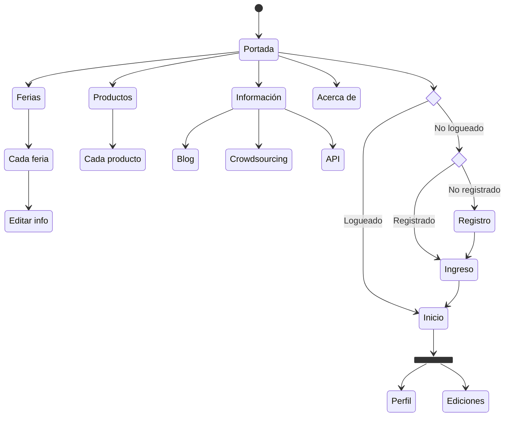

# Configuración del sitio

Estos son algunos consejos e instrucciones para usar el proyecto localmente o en el servidor.

## Clave secreta de Django

La clave secreta de Django y otras configuraciones están en un archivo `.env` y es manipulado por el paquete `python-decouple` ([documentación](https://pypi.org/project/python-decouple/)).

(Opcional) Crear un ambiente virtual para correr el proyecto (recomendado).

```bash
ferias: $ python -m venv feriasenv
```

y activarlo con:

```bash
source feriasenv/bin/activate
```

y desactivarlo con:

```bash
deactivate
```

Para iniciar, instalar todos los paquetes especificados en el archivo `requirements.txt`, con:

```bash
pip install -r requirements.txt
```

Se agrega el archivo `.env` al directorio raíz. Nota: (en caso de ser necesario) al descargar el archivo `.env` y pasarlo al directorio raíz puede salir como `.env.env` se debe cambiar esto a solo `.env`.

(Seguir instrucciones de la documentación).

> El equipo de desarrolladores compartirá el documento `.env`.

Luego, se deben instalar los siguientes paquetes:

```bash
pip install django
```

En el archivo `requirements.txt` está el resto de paquetes de Python necesarios para la ejecución. Para esto, hacer:

```bash
pip install -r requirements.txt
```

Por último, Para ejecutar el proyecto se utiliza el comando:

```bash
python manage.py runserver
```

Para acceder al sitio en desarrollo se realiza mediante `localhost` en el puerto seleccionado, típicamente `http://127.0.0.1:8000/`.

## Crear base de datos y migrar a GeoDjango

El proyecto utiliza [PostgreSQL](https://www.postgresql.org/). Una vez instalado puede ser controlado en terminal con `psql`, por ejemplo: `psql ferias` para entrar al CLI de la base de datos y hacer _queries_ o modificar las tablas directamente. Nota: mucho cuidado con esto porque puede interferir con las migraciones de Django y causar problemas. 

[GeoDjango](https://docs.djangoproject.com/en/4.2/ref/contrib/gis/) es la extensión de Django para trabajar con datos geoespaciales. Será utilizado con PostgreSQL y PostGIS.

Los pasos de creación de la base de datos son:

- Instalar PostgreSQL en la máquina según el OS.
- Instalar PostGIS en la máquina [según el OS](https://postgis.net/documentation/getting_started/#installing-postgis).
- Crear base de datos `ferias` con `$ createdb ferias`.
- Ingresar a la base de datos con `$ psql ferias`.
- [Habilitar PostGIS](https://docs.djangoproject.com/en/4.2/ref/contrib/gis/install/postgis/) para la base de datos `ferias` en `psql` con `# CREATE EXTENSION postgis;`.
- Habilitar la búsqueda por [_trigram similarity_](https://docs.djangoproject.com/en/4.2/ref/contrib/postgres/lookups/#trigram-similarity) en `psql ferias` con `CREATE EXTENSION IF NOT EXISTS pg_trgm;`
- Habilitar la búsqueda [_sin acentos_](https://www.postgresql.org/docs/current/unaccent.html) en `psql ferias` con `CREATE EXTENSION IF NOT EXISTS unaccent;`
- En `settings.py` está (asumiendo que la DB no tiene password):
```python
DATABASES = {
    "default": {
        "ENGINE": "django.contrib.gis.db.backends.postgis",
        "NAME": config('DB_NAME'),
        "USER": config('DB_USER'),
    },
}
```
y además:
```python
INSTALLED_APPS = [
    (...)
    "django.contrib.postgres",
    "django.contrib.gis",
]
```
- Modificar `.env` (asumiendo que el usuario de PostgreSQL es `postgres`, y si no lo sabe puede hacer en psql: `# SELECT current_user;`):
```
DB_NAME=ferias
DB_USER=postgres
```
- (Opcional) En algunos sistemas operativos (Windows y macOS Apple Silicon sí, Linux y macOS Intel no), es necesario adjuntar a `settings.py` las ubicaciones de GDAL y GEOS (esto se hace automáticamente):
```python
import platform
(...)
DATABASES = {
    "default": {
        "ENGINE": "django.contrib.gis.db.backends.postgis",
        "NAME": config('DB_NAME'),
        "USER": config('DB_USER'),
    },
}

if not (platform.platform() == "Linux" or platform.machine() == "x86_64"):
    GDAL_LIBRARY_PATH = config('GDAL_LIBRARY_PATH')
    GEOS_LIBRARY_PATH = config('GEOS_LIBRARY_PATH')
```
y en `.env`:
```
GDAL_LIBRARY_PATH=/opt/homebrew/opt/gdal/lib/libgdal.dylib
GEOS_LIBRARY_PATH=/opt/homebrew/opt/geos/lib/libgeos_c.dylib
```
o lo que corresponda según el sistema operativo.
- Hacer todas las migraciones con `$ python manage.py makemigrations marketplaces` y así para cada app (products, crowdsourcing, website, etc.)
- Migrar con `$ python manage.py migrate` para crear las tablas.
- Hacer `$ python manage.py loaddata auth` para cargar los datos de usuarios de prueba del fixture (peligroso).
- Hacer `$ python manage.py loaddata marketplaces` para cargar los datos de las ferias del fixture (peligroso).
- Hacer `$ python manage.py loaddata products` para cargar los datos de los productos del fixture (peligroso).
- (etc.)

Con esto debería funcionar la aplicación con PostgreSQL y PostGIS activado para usar GeoDjango, que permite guardar ubicaciones y regiones en el mapa y hacer búsquedas geoespaciales.

### Destruir la base de datos

En caso de pruebas y de ser necesario:

- `$ psql postgres`
- `# DROP DATABASE ferias;`
- :grimacing:
- Borrar todos los archivos de migraciones de todas las apps antes de intentar hacer las migraciones de nuevo

## Cómo actualizar el servidor

- Hacer cambios en una rama dedicada para tal fin
- Probar los cambios y fusionar (o hacer PR) con `main`
- Luego hacer una fusión con `server` que es la rama en el servidor
- Entrar al servidor con SSH al usuario `tcu`
- Si **no** hay cambios en los esquemas de la base de datos:
  - `cd ferias/`
  - `git status`
  - `git stash` (opcional, para "poner al lado" cualquier modificación hecha en el servidor, que idealmente no deberían existir, excepto para "remiendos" temporales)
  - `git pull`
  - `sudo systemctl restart nginx`
  - `sudo systemctl restart gunicorn`
- Si **sí** hay cambios en los esquemas de la base de datos (en algún `models.py`)
  - `cd ferias/`
  - `git status`
  - `git stash`
  - `git pull`
  - Entrar al ambiente virtual: `source feriasenv/bin/activate`
  - Por _prevención_, se puede hacer una descarga de las tablas que van a ser modificadas, con `python manage.py dumpdata <app>.<model>` para guardar en el fixture `<app>.json` o `<app>_<model>.json`. Esto es importante porque las migraciones pueden salir mal.
  - Hacer las migraciones de cada app: `python manage.py makemigrations <app>`
  - Migrar: `python manage.py migrate`
  - (Aquí pueden pasar un montón de cosas tenebrosas con la base de datos)
  - Salir del ambiente virtual: `deactivate`
  - `sudo systemctl restart nginx`
  - `sudo systemctl restart gunicorn`

Con suerte, vamos al navegador y probamos si funciona.

## Problemas cargando archivos estáticos por error 403 Forbidden

Para servir archivos estáticos en el servidor es necesario hacer lo [usual](https://docs.djangoproject.com/en/4.2/howto/static-files/):

```bash
(feriasenv) tcu@ubuntu-ferias:~/ferias python manage.py collectstatic
```

Sin embargo, puede haber problemas al cargar imágenes o CSS, JS, etc. con un error 403 Forbidden. Esto sucede [típicamente](https://www.digitalocean.com/community/questions/i-m-getting-a-403-forbidden-error-when-trying-to-access-static-files) por permisos o la propiedad de los archivos. La solución a la última configuración fue:

```bash
sudo gpasswd -a tcu www-data
```

que le da permisos al usuario `tcu` dentro de `www-data`.

Es posible probar la asignación con `getent group www-data`, que devolverá algo como `www-data:x:33:tcu`. ¿Qué es [www-data](https://askubuntu.com/questions/873839/what-is-the-www-data-user)?

Luego de esto viene el reinicio usual de Nginx y Gunicorn (que no sé si será estrictamente necesario).

Otra forma de resolver (cuando le da la gana) este problema es asignando manualmente y directamente los permisos a `www-data` para acceder a `staticfiles/`, así:

```bash
sudo chown -R www-data:www-data /path/to/static/files
```

y luego:

```bash
sudo chown -R www-data:www-data /path/to/static/files
```

y finalmente reiniciando Nginx y Gunicorn.

## Aplicaciones del sitio

Django utiliza "apps" para manejar el sitio. Por experiencia, sabemos que son divisiones útiles para la organización del sitio, aunque realmente desde una sola app se podrían realizar todas las funciones. Por orden, sin embargo, es mejor hacer una separación funcional. En ese sentido, y con base en la funcionalidad esperada del sitio, se han creado los siguientes apps:

<dl>
    <dt>sitio</dt>
    <dd>Administra páginas generales, como el "index", acerca de, contacto, etc.</dd>
    <dt>datos</dt>
    <dd>Administra la base de datos de ferias.</dd>
    <dt>productos</dt>
    <dd>Administra la base de datos de productos ofrecidos en las ferias.</dd>
    <dt>informacion</dt>
    <dd>Administra las páginas de información para visitantes, como blogs, tutoriales, etc.</dd>
    <dt>crowdsourcing</dt>
    <dd>Administra la colaboración colectiva para el mantenimiento y actualización de datos de las ferias y productos.</dd>
    <dt>api</dt>
    <dd>Administra un API público para que cualquier persona recopile datos de este proyecto.</dd>
    <dt>usuarios</dt>
    <dd>Administra los distintos tipos de usuarios del sitio.</dd>
</dl>

## Páginas del sitio

Con base en la funcionalidad descrita, es posible crear un primer esbozo de las páginas que tendrá el sitio (arquitectura de información), clasificadas según el app que las gestiona:

- ***sitio***
    - `/`: página de bienvenida
    - `/acerca`, `/contacto`, etc.: información sobre el sitio web
- ***datos***
    - `/ferias`: página de meta información sobre los datos que contiene la página
    - `/ferias/<código-de-feria>`: información básica de la feria
    - `/ferias/<código-de-feria>/edicion`: edición de la información
- ***productos***
    - `/productos`: página de meta información sobre los datos que contiene la página
    - `/productos/<código-de-producto>`: editor de datos del producto elegido
- ***informacion***
    - `/informacion`: página de bienvenida a la sección de información
    - `/blog`, `/articulo`, etc.: otros sitios
- ***crowdsourcing***
    - `/colaboracion`: página de bienvenida de la sección de colaboración colectiva
    - `/colaboracion/`:
- ***api***
    - `/api`: página de bienvenida e información sobre el API el proyecto
- ***usuarios***
    - `/usuarios`: página de información de usuarios
    - `/usuarios/perfil`: página de información de la persona usuaria

### Mapa del sitio



# Anexos

## Cómo instalar PostgreSQL en macOS

Nota: en Ubuntu viene instalado por defecto.

Con Homebrew:

```bash
brew update
```
para tener la última versión de Homebrew. Luego:
```bash
brew install postgresql
```
para instalar PostgreSQL. Para activarlo, es necesario hacer:
```bash
brew services start postgresql
```
Nota: es posible que sea `brew services start postgresql@14`. Y finalmente es posible comprobar su funcionamiento con:
```bash
brew services list
```
Ahora hay que instalar PostGIS, con:
```bash
brew install postgis
```
Luego es posible seguir el procedimiento de migración a GeoDjango indicado arriba.

### Problemas con GDAL

A veces GDAL da problemas. (GDAL sirve para PostGIS). Con la reciente actualización de Homebrew, algo estaba saliendo mal, que decía tipo:

```
...
from django.contrib.gis.gdal.prototypes import ds as vcapi
...
Reason: tried: '/opt/homebrew/opt/hdf5/lib/libhdf5_hl.200.dylib' (no such file) ... '/usr/lib/libhdf5_hl.200.dylib' (no such file, not in dyld cache)
```

La solución (aparentemente riesgosa) fue hacer:

```bash
brew reinstall gdal --build-from-source
```

que parece que sabían sus creadores de [OSGEO](https://github.com/OSGeo/homebrew-osgeo4mac/issues/1368#issuecomment-596452645). 
