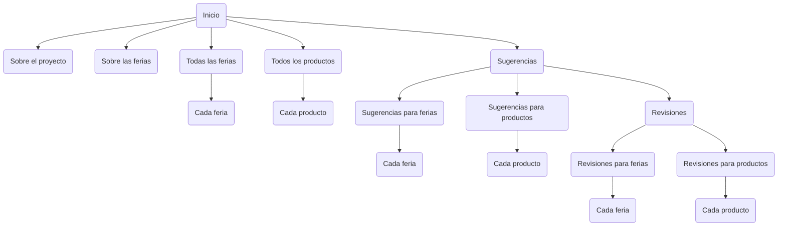

# Mapa del sitio

:globe_with_meridians: **Página de inicio**
`/`
("inicio")
app: `website`

Página de bienvenida al sitio con buscador, características

:globe_with_meridians: **Sobre el proyecto**
`/sobre/`
("sobre")
app: `website`

Página de información sobre el proyecto, incluyendo la coordinación, las personas que trabajaron, colaboradores, etc.

:globe_with_meridians: **Sobre las ferias del agricultor**
`/sobre/ferias/`
("sobre_ferias")
app: `website`

Página de información sobre las ferias del agricultor, incluyendo historia, legislación, etc.

:wave: **Todas las ferias**
`/ferias/`
("ferias")
app: `marketplaces`

Datos generales de las ferias (ubicación, ferias por provincia, días de la semana, amenidades, infraestructura), el buscador de ferias y la lista de las ferias (nombre con link más provincia)

:wave: **Página de cada feria**
`/ferias/<marketplace_url>`
("feria")
app: `marketplaces`

Para cada feria: horario, dirección y mapa. Lista de amenidades e infraestructura. Otras ferias cercanas. Información de contacto.

:tomato: **Todos los productos**
`/productos/`
("productos")
app: `products`

Lista de todos los productos según categoría: frutas, verduras, tubérculos y raíces, legumbres, hierbas y otros.

:tomato: **Página de cada producto**
`/ferias/<product_url>`
("producto")
app: `products`

Para cada feria: horario, dirección y mapa. Lista de amenidades e infraestructura. Otras ferias cercanas. Información de contacto.

:speech_balloon: **Sugerencias para ferias y productos**
`/sugerencias/`
("sugerencias")
app: `crowdsourcing`

Página de bienvenida a la sección de colaboración colectiva, con una lista de todas las ferias y productos donde se puede colaborar con datos.

:speech_balloon: **Sugerencias para ferias**
`/sugerencias/ferias/`
("sugerencias_ferias")
app: `crowdsourcing`

Lista de todas las ferias donde se puede colaborar con datos.

:speech_balloon: **Sugerencias para cada feria**
`/sugerencias/ferias/<marketplace_url>`
("producto")
app: `crowdsourcing`

Formulario con los datos que se pueden aportar de cada feria.

:speech_balloon: **Sugerencias para productos**
`/sugerencias/productos/`
("sugerencias_productos")
app: `crowdsourcing`

Lista de todos los productos donde se puede colaborar con datos.

:speech_balloon: **Sugerencias para cada producto**
`/sugerencias/productos/<product_url>`
("sugerencias_producto")
app: `crowdsourcing`

Formulario con los datos que se pueden aportar de cada producto.

:white_check_mark: **Revisión de sugerencias para ferias y productos**
`/sugerencias/revisiones/`
("revisiones")
app: `crowdsourcing`

Página de bienvenida a la sección de colaboración colectiva, con una lista de todas las ferias y productos donde se puede colaborar con datos.

:white_check_mark: **Revisión de sugerencias para ferias**
`/sugerencias/revisiones/ferias/`
("revisiones_ferias")
app: `crowdsourcing`

Lista de todas las ferias donde se puede revisar los datos.

:white_check_mark: **Revisión de sugerencias para cada feria**
`/sugerencias/revisiones/ferias/<marketplace_url>`
("revisiones_feria")
app: `crowdsourcing`

Formulario con la revisión de los datos que se pueden aportar de cada feria.

:white_check_mark: **Revisión de sugerencias para productos**
`/sugerencias/revisiones/productos/`
("revisiones_productos")
app: `crowdsourcing`

Lista de todos los productos donde se puede revisar los datos.

:white_check_mark: **Revisión de sugerencias para cada producto**
`sugerencias/revisiones/productos/<product_url>`
("revisiones_producto")
app: `crowdsourcing`

Formulario con la revisión de los datos que se pueden aportar de cada producto.

:key: **Ingresar a la cuenta del sitio**
`/ingresar/`
("ingresar")
app: `website`

Formulario para ingreso a la cuenta.

:key: **Salir de la cuenta del sitio**
`/salir/`
("salir")
app: `website`

Salir del sitio (lleva al formulario de ingreso con un mensaje).

## Primer lanzamiento

El primer lanzamiento del sitio tiene una versión nueva del formato y, sobre todo, de las páginas de cada feria y cada producto. Además, tiene la funcionalidad de colaboración colectiva, donde la gente puede hacer sugerencias y nosotros podemos revisar y actualizar los datos de cada feria y producto. No tiene la funcionalidad de blog, y está pensada, sobre todo, para revisión entre un número limitado de personas.

Páginas:

- [ ] Inicio
- [ ] Sobre el proyecto
- [ ] Sobre las ferias
- [ ] Todas las ferias
- [ ] Página de cada feria
- [ ] Todos los productos
- [ ] Página de cada producto
- [ ] Sugerencias
- [ ] Sugerencias de ferias
- [ ] Sugerencias de cada feria
- [ ] Sugerencias de productos
- [ ] Sugerencias cada producto
- [ ] Revisión de sugerencias
- [ ] Revisión de sugerencias de ferias
- [ ] Revisión de sugerencias de cada feria
- [ ] Revisión de sugerencias de productos
- [ ] Revisión de sugerencias de cada producto
- [ ] Ingresar
- [ ] Salir

## Segundo lanzamiento

El segundo lanzamiento puede o no tener la funcionalidad de blog, pero ya los datos de ferias y productos estarán revisados y el diseño depurado.
