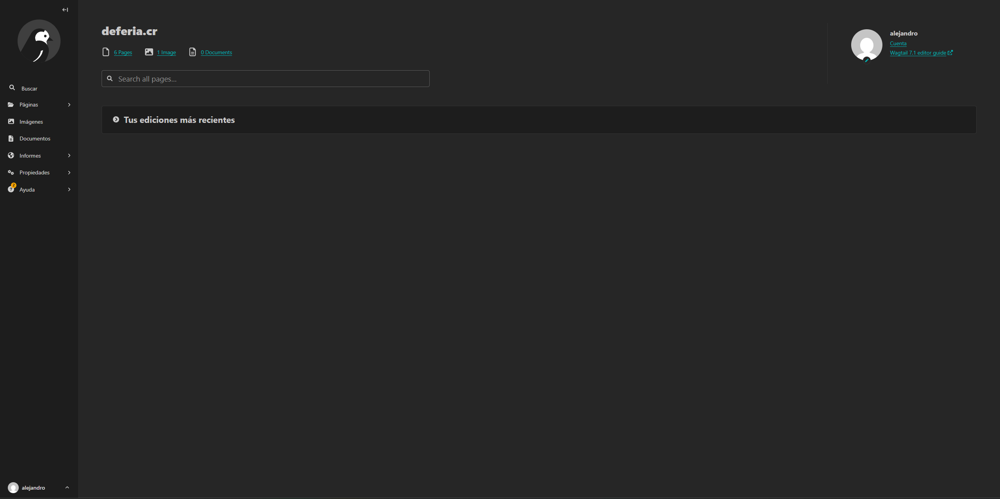
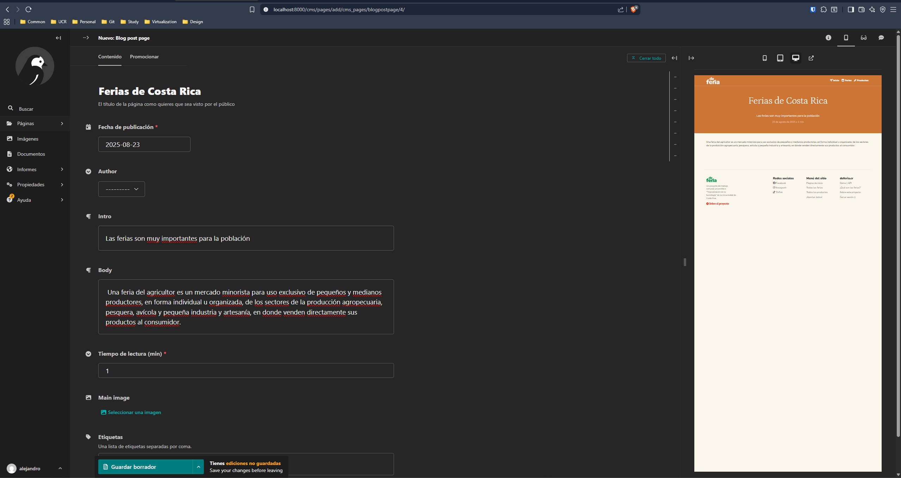

# Manual informativo para usar y desarrollar CMS

> [!WARNING]
> Tanto este manual como el CMS siguen en desarrollo.

## Dependencias

El CMS (Wagtail) ya se encuentra implementado en la estructura base del proyecto, y sus dependencias ya fueron agregadas al contenedor de Docker. Para hacer uso del CMS, es necesario haber seguido todos los pasos presentes en el [Manual para habilitar un ambiente de desarrollo con Docker](HOWTO.md), incluída la creación del usuario administrador, ya que de lo contrario no se puede acceder.

## Desarrollo

El CMS se encuentra implementado dentro del directorio `apps`, especificamente en la carpeta `cms_pages`.

Para agregar un nuevo tipo de página, se debe agregar la misma a `models.py` y se le debe crear templates dentro de `templates/cms_pages`. Esto porque es lo que necesita Wagtail para poder generar una página. Puede seguir el ejemplo del **blog** en caso de ser necesario.

## Acceso

Al ingresar a la URL del CMS se muestra una pantalla de inicio de sesión, aquí debe colocar las credenciales con las que creó el usuario administrador. Tras esto debería de poder iniciar sesión y ver una pantalla de inicio similar a la siguiente:

## Probar Wagtail

Para probar el CMS, se recomienda intentar crear una página y "travesear" las funcionalidades que brinda el mismo.

### Ejemplo de Blog

En la siguiente imagen, se ve un ejemplo de la creación de una página de blog dentro del CMS. Donde se le pide cierta información al usuario, y en base a esta, el CMS crea el sitio web. 

El resultado de esto sería la siguiente página de blog la cuál se puede accesar desde el mismo CMS con ayuda del ícono de previsualización.

## Problemas comunes

> [!NOTE]
> No se han encontrado problemas para iniciar el CMS, pero de encontrar alguno, por favor reportarlo o si tiene solución simple, agregarla a esta sección del manual.

