# Diseño de la identidad visual

## Nombre

"De feria" es una alusión a frases comunes, como:

- "¡Vamos de feria!"
- "Frescura, variedad y precios de feria"
- "De feria": de gratis, extra
- "Tras de feria": adicionalmente, para rematar, tras de todo

Los nombres utilizados en el proyecto son:

- de feria / deferia / De Feria / DeFeria 
- deferia.cr (URL del sitio web)

## Logo

Variedades de color

&nbsp;&nbsp;
&nbsp;&nbsp;
&nbsp;&nbsp;
&nbsp;&nbsp;

## Tipografía

La identidad visual, incluyendo el sitio web, utiliza dos fuentes tipográficas:

- Nunito Sans (disponible en [Google Fonts](https://fonts.google.com/specimen/Nunito+Sans)): sans serif (palo seco) para textos y el logo.
- Petrona (disponible en [Google Fonts](https://fonts.google.com/specimen/Petrona)): serifa para títulos.

## Paleta de colores

Paleta seleccionada para reflejar la riqueza visual de las ferias, con colores en tonos tierra pero con altos contrastes.

| Nombre   | HEX    | RGB           | Muestra                        |
|----------|--------|---------------|--------------------------------|
| Amarillo | EBB615 | 235, 181, 21  | :material-circle:{ .amarillo } |
| Verde    | 008D4A | 0, 141, 74    | :material-circle:{ .verde }    |
| Azul     | 3879B5 | 56, 121, 182  | :material-circle:{ .azul }     |
| Gris     | D1C5BA | 209, 197, 186 | :material-circle:{ .gris }     |
| Rojo     | E64128 | 230, 65, 40   | :material-circle:{ .rojo }     |
| Café     | CD7535 | 205, 117, 53  | :material-circle:{ .cafe }     |
| Rosado   | F29196 | 242, 145, 150 | :material-circle:{ .rosado }   |
| Negro    | 000000 | 0, 0, 0       | :material-circle:{ .negro }    |

## Elementos gráficos

Para complementar la identidad visual, fueron diseñados una inmensa cantidad de íconos para representar los productos de la feria en nuestra base de datos.

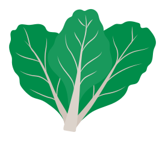&nbsp;&nbsp;
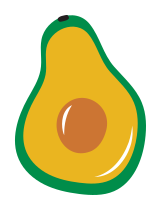&nbsp;&nbsp;
&nbsp;&nbsp;
&nbsp;&nbsp;
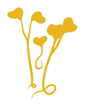&nbsp;&nbsp;
&nbsp;&nbsp;
&nbsp;&nbsp;
&nbsp;&nbsp;
&nbsp;&nbsp;
&nbsp;&nbsp;
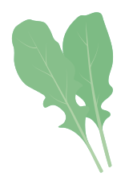&nbsp;&nbsp;
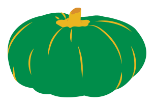&nbsp;&nbsp;
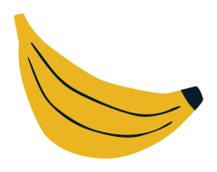&nbsp;&nbsp;
&nbsp;&nbsp;
&nbsp;&nbsp;
&nbsp;&nbsp;
&nbsp;&nbsp;
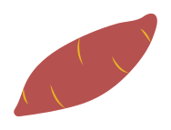&nbsp;&nbsp;
&nbsp;&nbsp;
&nbsp;&nbsp;
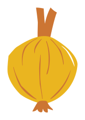&nbsp;&nbsp;
&nbsp;&nbsp;
&nbsp;&nbsp;
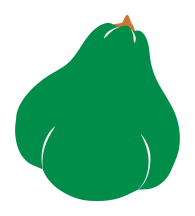&nbsp;&nbsp;
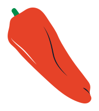&nbsp;&nbsp;
&nbsp;&nbsp;
&nbsp;&nbsp;
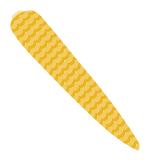&nbsp;&nbsp;
&nbsp;&nbsp;
&nbsp;&nbsp;
&nbsp;&nbsp;
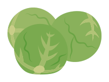&nbsp;&nbsp;
&nbsp;&nbsp;
&nbsp;&nbsp;
&nbsp;&nbsp;
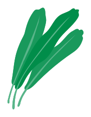&nbsp;&nbsp;
&nbsp;&nbsp;
&nbsp;&nbsp;
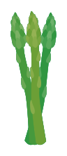&nbsp;&nbsp;
&nbsp;&nbsp;
&nbsp;&nbsp;
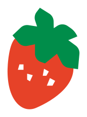&nbsp;&nbsp;
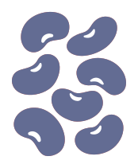&nbsp;&nbsp;
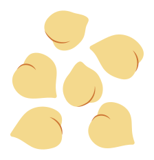&nbsp;&nbsp;
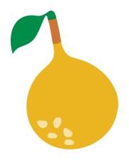&nbsp;&nbsp;
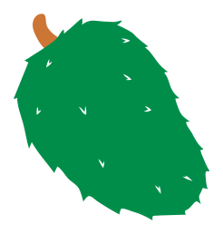&nbsp;&nbsp;
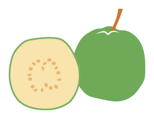&nbsp;&nbsp;
&nbsp;&nbsp;
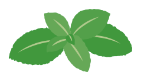&nbsp;&nbsp;
&nbsp;&nbsp;
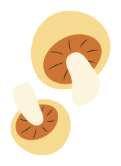&nbsp;&nbsp;
&nbsp;&nbsp;
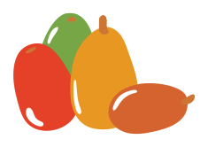&nbsp;&nbsp;
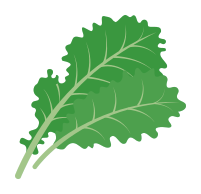&nbsp;&nbsp;
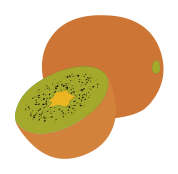&nbsp;&nbsp;
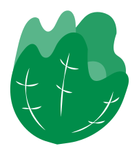&nbsp;&nbsp;
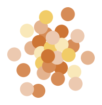&nbsp;&nbsp;
&nbsp;&nbsp;
&nbsp;&nbsp;
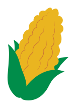&nbsp;&nbsp;
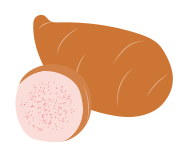&nbsp;&nbsp;
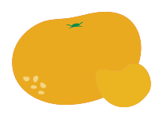&nbsp;&nbsp;
&nbsp;&nbsp;
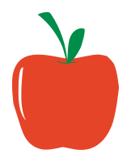&nbsp;&nbsp;
&nbsp;&nbsp;
&nbsp;&nbsp;
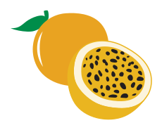&nbsp;&nbsp;
&nbsp;&nbsp;
&nbsp;&nbsp;
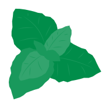&nbsp;&nbsp;
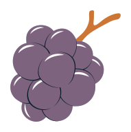&nbsp;&nbsp;
&nbsp;&nbsp;
&nbsp;&nbsp;
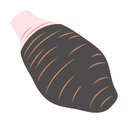&nbsp;&nbsp;
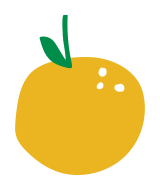&nbsp;&nbsp;
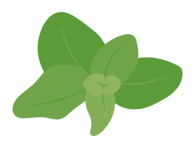&nbsp;&nbsp;
&nbsp;&nbsp;
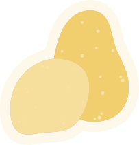&nbsp;&nbsp;
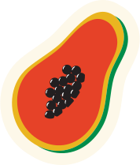&nbsp;&nbsp;
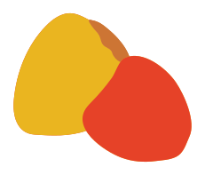&nbsp;&nbsp;
&nbsp;&nbsp;
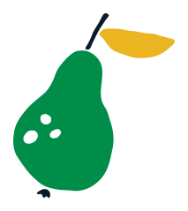&nbsp;&nbsp;
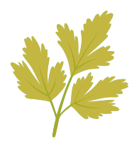&nbsp;&nbsp;
&nbsp;&nbsp;
&nbsp;&nbsp;
&nbsp;&nbsp;
&nbsp;&nbsp;
&nbsp;&nbsp;
&nbsp;&nbsp;
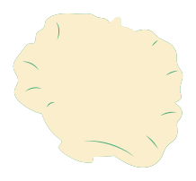&nbsp;&nbsp;
&nbsp;&nbsp;
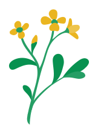&nbsp;&nbsp;
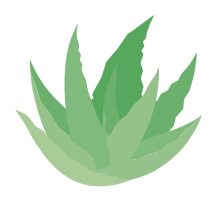&nbsp;&nbsp;
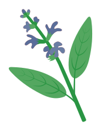&nbsp;&nbsp;
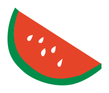&nbsp;&nbsp;
&nbsp;&nbsp;
&nbsp;&nbsp;
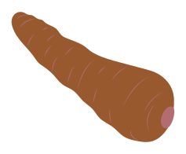&nbsp;&nbsp;
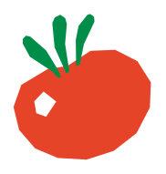&nbsp;&nbsp;
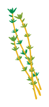&nbsp;&nbsp;
&nbsp;&nbsp;
&nbsp;&nbsp;
&nbsp;&nbsp;
&nbsp;&nbsp;
&nbsp;&nbsp;
&nbsp;&nbsp;
&nbsp;&nbsp;
&nbsp;&nbsp;
