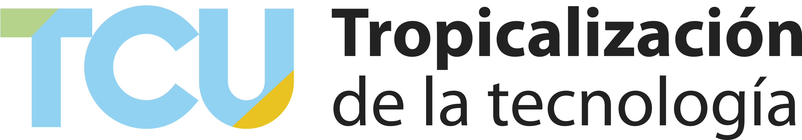

# deferia.cr

De Feria es un proyecto de trabajo comunal universitario de la Universidad de Costa Rica, desarrollado por TC-691 "Tropicalización de la tecnología" de la Escuela de Ingeniería Eléctrica, con la dirección del profesor Fabián Abarca Calderón.

De Feria tiene el apoyo técnico y logístico de FAO Costa Rica.

